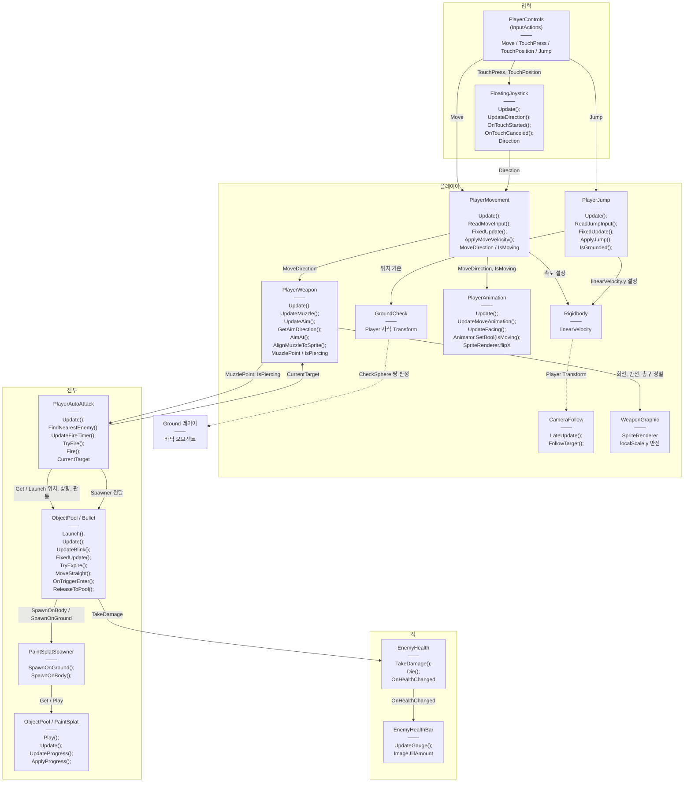

# 구현 다이어그램
> 구현마다 최신화하여 갱신한다. (최종 갱신: 2026-11-04, `탄환 직선·관통 구현`)

```mermaid
flowchart TD
    subgraph InputGroup["입력"]
        Input["PlayerControls<br/>(InputActions)<br/>───<br/>Move / TouchPress / TouchPosition / Jump"]
        Joystick["FloatingJoystick<br/>───<br/>Update();<br/>UpdateDirection();<br/>OnTouchStarted();<br/>OnTouchCanceled();<br/>Direction"]
    end

    subgraph PlayerGroup["플레이어"]
        Movement["PlayerMovement<br/>───<br/>Update();<br/>ReadMoveInput();<br/>FixedUpdate();<br/>ApplyMoveVelocity();<br/>MoveDirection / IsMoving"]
        Body["Rigidbody<br/>───<br/>linearVelocity"]
        Jump["PlayerJump<br/>───<br/>Update();<br/>ReadJumpInput();<br/>FixedUpdate();<br/>ApplyJump();<br/>IsGrounded();"]
        GroundCheck["GroundCheck<br/>───<br/>Player 자식 Transform"]
        Animation["PlayerAnimation<br/>───<br/>Update();<br/>UpdateMoveAnimation();<br/>UpdateFacing();<br/>Animator.SetBool(IsMoving);<br/>SpriteRenderer.flipX"]
        Camera["CameraFollow<br/>───<br/>LateUpdate();<br/>FollowTarget();"]
        Weapon["PlayerWeapon<br/>───<br/>Update();<br/>UpdateMuzzle();<br/>UpdateAim();<br/>GetAimDirection();<br/>AimAt();<br/>AlignMuzzleToSprite();<br/>MuzzlePoint / IsPiercing"]
        WeaponGraphic["WeaponGraphic<br/>───<br/>SpriteRenderer<br/>localScale.y 반전"]
    end

    subgraph CombatGroup["전투"]
        AutoAttack["PlayerAutoAttack<br/>───<br/>Update();<br/>FindNearestEnemy();<br/>UpdateFireTimer();<br/>TryFire();<br/>Fire();<br/>CurrentTarget"]
        Bullet["ObjectPool / Bullet<br/>───<br/>Launch();<br/>Update();<br/>UpdateBlink();<br/>FixedUpdate();<br/>TryExpire();<br/>MoveStraight();<br/>OnTriggerEnter();<br/>ReleaseToPool();"]
        Spawner["PaintSplatSpawner<br/>───<br/>SpawnOnGround();<br/>SpawnOnBody();"]
        PaintSplat["ObjectPool / PaintSplat<br/>───<br/>Play();<br/>Update();<br/>UpdateProgress();<br/>ApplyProgress();"]
    end

    subgraph EnemyGroup["적"]
        EnemyHealth["EnemyHealth<br/>───<br/>TakeDamage();<br/>Die();<br/>OnHealthChanged"]
        EnemyHealthBar["EnemyHealthBar<br/>───<br/>UpdateGauge();<br/>Image.fillAmount"]
    end

    GroundLayer["Ground 레이어<br/>───<br/>바닥 오브젝트"]

    Input -->|TouchPress, TouchPosition| Joystick
    Input -->|Move| Movement
    Joystick -->|Direction| Movement
    Movement -->|속도 설정| Body
    Movement -->|MoveDirection, IsMoving| Animation
    Body -.->|Player Transform| Camera
    Movement -->|MoveDirection| Weapon
    Weapon -->|회전, 반전, 총구 정렬| WeaponGraphic
    AutoAttack -->|CurrentTarget| Weapon
    Weapon -->|MuzzlePoint, IsPiercing| AutoAttack
    AutoAttack -->|Get / Launch 위치, 방향, 관통| Bullet
    AutoAttack -->|Spawner 전달| Bullet
    Bullet -->|TakeDamage| EnemyHealth
    Bullet -->|SpawnOnBody / SpawnOnGround| Spawner
    Spawner -->|Get / Play| PaintSplat
    EnemyHealth -->|OnHealthChanged| EnemyHealthBar
    Input -->|Jump| Jump
    Jump -->|위치 기준| GroundCheck
    GroundCheck -.->|CheckSphere 땅 판정| GroundLayer
    Jump -->|linearVelocity.y 설정| Body
```
