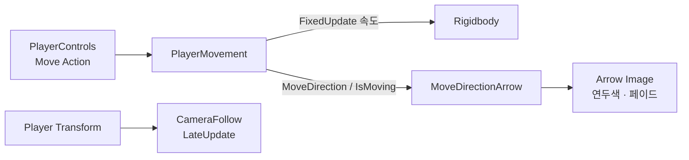

## 구현 다이어그램
> 기능 구현마다 최신화하여 갱신한다.

```mermaid
flowchart LR
    Input[PlayerControls<br/>Move Action] --> PM[PlayerMovement]
    PM -->|FixedUpdate 속도| RB[Rigidbody]
    PM -->|MoveDirection / IsMoving| Arrow[MoveDirectionArrow]
    Arrow --> Img[Arrow Image<br/>연두색 · 페이드]
    Player[Player Transform] --> Cam[CameraFollow<br/>LateUpdate]
```
