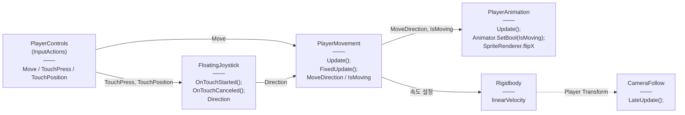

# 구현 다이어그램
> 구현마다 최신화하여 갱신한다. (최종 갱신: 2026-11-02, `261102FeatPlayerMovement`)

```mermaid
flowchart LR
    Input["PlayerControls<br/>(InputActions)<br/>───<br/>Move / TouchPress / TouchPosition"]
    Joystick["FloatingJoystick<br/>───<br/>OnTouchStarted();<br/>OnTouchCanceled();<br/>Direction"]
    Movement["PlayerMovement<br/>───<br/>Update();<br/>FixedUpdate();<br/>MoveDirection / IsMoving"]
    Animation["PlayerAnimation<br/>───<br/>Update();<br/>Animator.SetBool(IsMoving);<br/>SpriteRenderer.flipX"]
    Body["Rigidbody<br/>───<br/>linearVelocity"]
    Camera["CameraFollow<br/>───<br/>LateUpdate();"]

    Input -->|TouchPress, TouchPosition| Joystick
    Input -->|Move| Movement
    Joystick -->|Direction| Movement
    Movement -->|속도 설정| Body
    Movement -->|MoveDirection, IsMoving| Animation
    Body -.->|Player Transform| Camera
```
